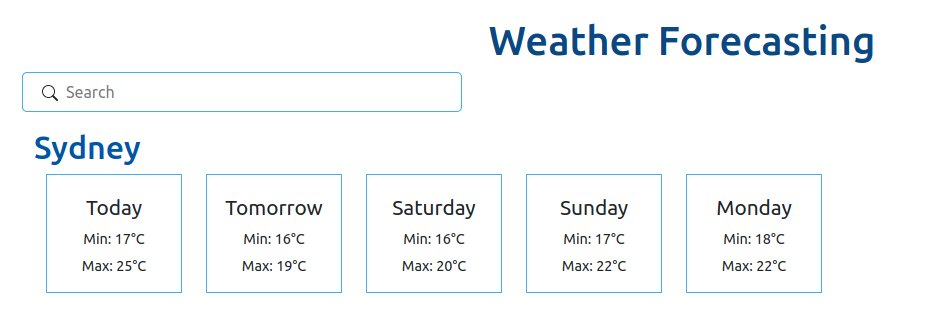

# Weather forecasting app 

  

This project was bootstrapped with [Create React App](https://github.com/facebook/create-react-app).

  

## Available Scripts

  
In the project directory, you can run:

  

### `yarn start`

  

Runs the app in the development mode.

Open [http://localhost:3000](http://localhost:3000) to view it in the browser.

  

### `yarn test`

Launches the test runner in the interactive watch mode.

## What I done so far
- Using React Hook to manage state
- Show forecasting for a location in 5 days, from today 
- Search for new location to get forecasting 
- Handle loading phase and Error  
- Handle redundant requests when typing search for locations  
- Apply some testings include: 
	- unit test for helper functions.
	- snapshot testing for Component.
	- react-hooks testing also.

##  Side note.
 Because the API on assignment has issue related to CORS when calling, so I these requests with a [proxy](https://gist.github.com/jesperorb/6ca596217c8dfba237744966c2b5ab1e) to bypass. Hence, the request may be slower than usual. 
 
 The good point is we have more time to check the loading phase >.^

